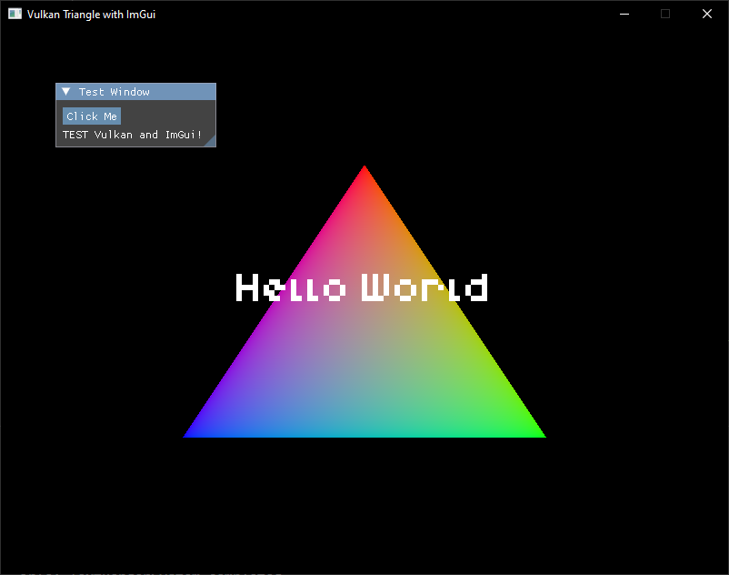
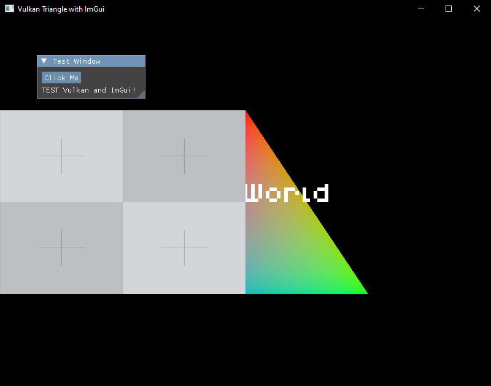
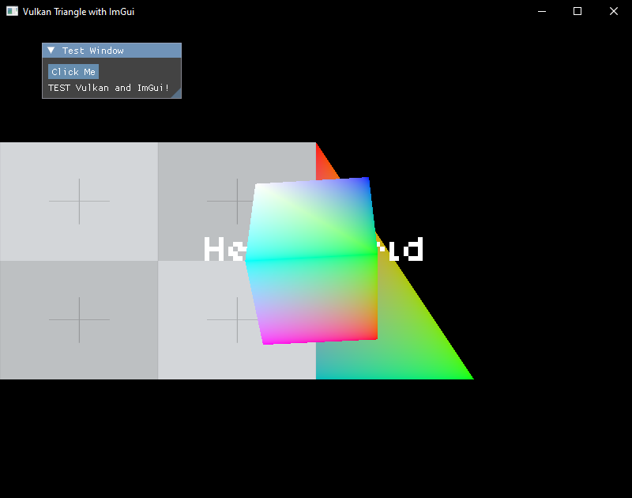

# sdl3_vulkan_flecs

# Table of Contents:
 * [License](#license)
 * [Status](#status)
 * [Overview](#overview)
 * [Features](#features)
 * [Requirements](#requirements)
 * [Libraries](#libraries)
 * [Project Structure](#project-structure)
 * [Goals](#goals)
 * [Building](#building)
 * [Running](#running)
 * [Module Design](#module-design)
 * [Vulkan Set Up and Render Flow:](#vulkan-set-up-and-render-flow)
 * [Dev Shader](#dev-shader)
 * [Notes](#notes)
 * [Planned Improvements](#planned-improvements)
 * [Images](#images)
 * [Credits](#credits)
 * [Contributing](#contributing)

# License:

This project is licensed under the MIT License. See LICENSE for details.

[](https://opensource.org/licenses/MIT)

# Status:
 - Work in progress
 - Added feautures to get vulkan working for simple things to set up and render.
 - No entity added yet need to check set up and render.

# Informtion:

A simple Vulkan-based project using SDL3 and Flecs for modular 3D rendering experiments.

# Overview:

This project is a testbed for building a modular 3D rendering system using Vulkan, SDL3, and the Flecs ECS framework. It currently features a basic triangle renderer with ImGui integration, aiming to expand into a flexible module-based design for 3D world-building experiments.

# Features:

- Modular Design (WIP):
    - Vulkan module for rendering and setup.
    - ImGui module for UI.
    - Easy addition/removal of modules for debugging and configuration.

- SDL 3.x (added)
    - resize window and vulkan swap render resize
    - need resize module call for event.
    - input system

- Vulkan Module (added)
    - Note there still some code example resize window is not reworked.
    - phase setup required for on start setup and run time order phase.
    - debugCallback
    - VK_LAYER_KHRONOS_validation
    - set up:
      - InstanceSetupSystem
      - SurfaceSetupSystem
      - DeviceSetupSystem
      - SwapchainSetupSystem
      - RenderPassSetupSystem
      - FramebufferSetupSystem
      - CommandPoolSetupSystem
      - CommandBufferSetupSystem
      - SyncSetupSystem
    - run time render:
      - BeginRenderSystem
      - BeginCMDBufferSystem
      - place holder for module render command buffer
      - EndCMDBufferSystem
      - EndRenderSystem

- Simple Triangle: (added)
    - module design
    - Setup system
      - Vertex Buffer 
      - VkPipelineShader setup
      - VkPipeline setup
    - buffer system
      - commandBuffer render for triangle 2d
    - hard code world context variable
    - resize not added
        
- ImGui Integration: (added)
    - made into command buffer imgui system to handle render vulkan.
    - check for imgui initialization for input handler to prevent crashing.
    - This wrapper from imgui to cimgui for c++ wrapper to c.
    - hard code world context variable.
    - resize added around ways

- Freetype Render Text font "Hello World" (added)
  - module for set up and render.
  - hard code world context variable
  - resize added

- Cube Mesh (added)
  - module (added)
  - resize (not added)
  
- Texture 2D (added)
  - module (added)
  - resize (not added)
        
- Flecs:
    - Custom logging system using Flecs, still under development.
    - add and remove entity not added for vulkan mesh or vertex buffer
    - module setup and render are added for SDL and Vulkan as those main build area.
    - 
        
- Planned Features:
    - network libs researching
    - luajit for entity handle script for off load?
    - 
        
# Requirements:
- CMake: For building the project.
- Visual Studio 2022: C/C++ development environment.
- Vulkan SDK 1.4.304.1: Required for Vulkan functionality.

## Libraries:

- Included:
    - [SDL 3.2.10](https://github.com/libsdl-org/SDL): Windowing and input.
    - [VulkanHeaders 1.4.304.1](https://github.com/KhronosGroup/Vulkan-Headers): Vulkan API headers.
    - [Flecs 4.0.5](https://github.com/SanderMertens/flecs): Entity Component System.
    - [cimgui](https://github.com/cimgui/cimgui) render graphic user interface.
    - [FreeType 2.13.3](https://github.com/freetype/freetype): Font rendering.
    - [stb](https://github.com/nothings/stb): stb_image.h
        
- Planned/Not Yet Added:
    - [VulkanMemoryAllocator 3.2.1](https://github.com/GPUOpen-LibrariesAndSDKs/VulkanMemoryAllocator): Memory management.
    - [mimalloc](https://github.com/microsoft/mimalloc): Memory allocator.
    - [cglm](https://github.com/recp/cglm): Math library.
    - [Assimp](https://github.com/assimp/assimp): Asset importing.
    
- Removed:
    - [Volk 1.4.304](https://github.com/zeux/volk): Replaced with direct Vulkan headers.

# Project Structure:

```text
sdl3_vulkan_flecs/
├── fonts/              # (Planned) Font assets
├── include/            # Header files
│   ├── flecs_imgui.h   # graphic user interface
│   ├── flecs_sdl.h     # SDL Input
│   ├── flecs_text.h    # freetype text font module
│   ├── flecs_types.h   # Global context for Flecs
│   ├── flecs_vulkan.h  # Vulkan setup and rendering
│   ├── frag.spv.h      # Compiled fragment triangle shader header
│   ├── text_frag.spv.h # Compiled fragment text header
│   ├── text_vert.spv.h # Compiled fragment text header
│   └── vert.spv.h      # Compiled vertex triangle shader header
├── shaders/            # Shader source files
│   ├── shader.frag     # Fragment shader
│   ├── shader.vert     # Vertex shader
│   ├── text.frag       # Fragment shader
│   └── text.vert       # Vertex shader
├── src/                # Source files
│   ├── flces_imgui.c   # graphic user interface module
│   ├── flces_sdl.c     # SDL input module and other add later
│   ├── flces_text.c    # Freetype font text module
│   ├── flecs_types.c   # Flecs context implementation
│   ├── flecs_vulkan.c  # Vulkan module logic
│   └── main.c          # Entry point
├── CMakeLists.txt      # CMake build configuration
├── build.bat           # Build script for VS2022
└── run.bat             # Run script
```

## Goals:
- Create a modular framework for 3D world-building tests.
- Leverage SDL3 for windowing/input, Vulkan for rendering, and Flecs for entity management.
- Minimize C++ usage, wrapping C libraries where beneficial (e.g., VulkanMemoryAllocator).

## Building:

1. Ensure CMake and Visual Studio 2022 are installed.
2. Install the Vulkan SDK 1.4.304.1.
3. Clone the repository:
    
bash
```bash
git clone https://github.com/yourusername/sdl3_vulkan_flecs.git
cd sdl3_vulkan_flecs
```
    
4. Run the build script (Windows, VS2022):
    
bash
```bash
build.bat
```
  This script handle config and compile application as well check if library for dll exist not to recompile dlls again. It reused dlls to save time compile the applicaiton.

## Running:

- Execute the run script:
    
bash
```bash
run.bat
```
- A window should open displaying a colored triangle and an ImGui "Test Window" with "Hello, Vulkan and ImGui!" text.
- Close the window to exit.

## Module Design:

The project uses a modular approach to simplify development:
- Vulkan Module: Handles initialization, rendering, and cleanup.
- ImGui Module: Manages UI setup and rendering.
- Freetype for render text font.
- Modules can be added or removed for debugging or feature testing.

### Vulkan Set Up and Render Flow:
- Setup (once):
    
    - InstanceSetupSystem -> SurfaceSetupSystem -> DeviceSetupSystem -> SwapchainSetupSystem -> RenderPassSetupSystem -> FramebufferSetupSystem -> CommandPoolSetupSystem -> CommandBufferSetupSystem -> [Pipeline Empty] -> SyncSetupSystem -> SetUpLogicSystem (modules init)

- Runtime (per frame):
    - LogicUpdatePhase: (empty for now)
    - BeginRenderPhase: BeginRenderSystem (acquire image)
    - BeginCMDBufferPhase: BeginCMDBufferSystem (start command buffer and render pass)
    - CMDBufferPhase: TriangleRenderBufferSystem -> TextRenderSystem -> ImGuiRenderSystem
    - EndCMDBufferPhase: EndCMDBufferSystem (end render pass and command buffer)
    - EndRenderPhase: EndRenderSystem (submit and present)

  This is minimal setup for vulkan to run correctly.

## Shaders:
- Shaders are written in GLSL and compiled to SPIR-V using the Vulkan SDK’s glslangValidator.
- Current approach embeds compiled shaders as headers (vert.spv.h, frag.spv.h) for simplicity.
- Source files (shader.vert, shader.frag) are provided for reference.

### Dev Shader:
  Note that using the Vulkan SDK tool are easy to compile shader type for header or spv file. This for windows default path for Vulkan SDK. It depend on vulkan version may change.

  Note that space in batch script is sensitive. 

 - shader.bat
 - shaderh.bat
    - This is for shader header file load application instead load from current directory file.

# Notes:
- Resize window will error on zero either height or width for vulkan layers.
- Hardcoding:
  - world context modules
  - resize for imgui
  - ...
- ImGui elements work in progress for debug 
- C++ Usage: Minimal, primarily for wrapping libraries like VulkanMemoryAllocator to reduce Vulkan boilerplate.
- Logging: Flecs-based logging is a work in progress and may be incomplete.

# Planned Improvements:
- Replace hardcoded elements with dynamic systems.
- Add VulkanMemoryAllocator for better memory management.
- Implement cube rendering and textures

# Images:





# Credits:
- [Vulkan Tutorial](https://vulkan-tutorial.com): Inspiration and guidance for Vulkan setup.
- [Kenney Fonts](https://kenney.nl/assets/kenney-fonts): Potential font assets (not yet integrated).
- https://x.com/i/grok (free tier, help setup build and readme docs)
- https://bevyengine.org everything into components. Base on how module for window setup idea. 

# Contributing:

Feel free to fork, submit issues, or send pull requests! This is an experimental project, and contributions are welcome.
